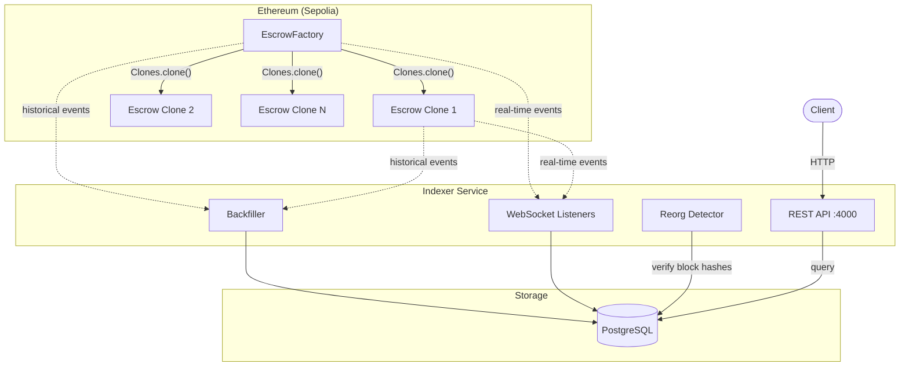
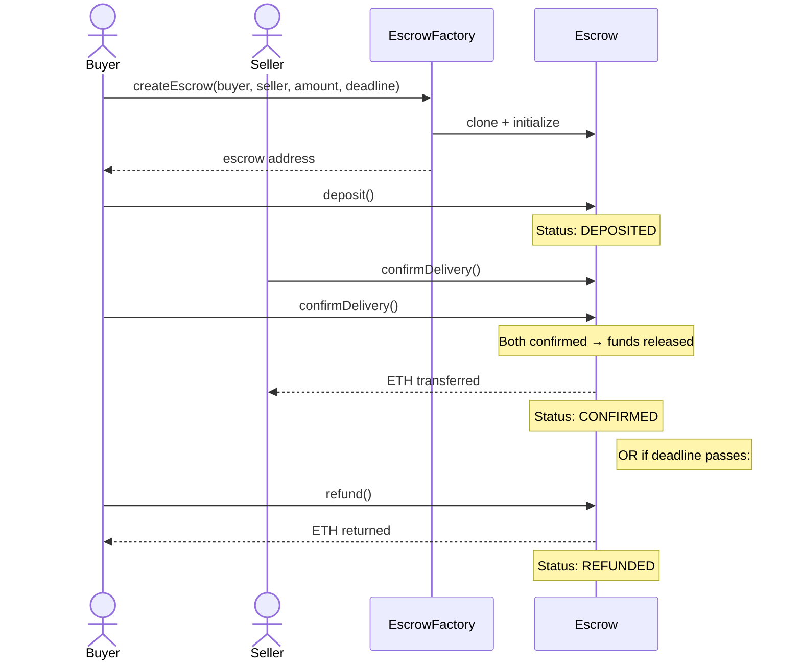

# Pinky Swear

Decentralized escrow dApp on Ethereum — Solidity smart contracts, event indexer, and REST API.

## How It Works

A buyer and seller agree on a trade. The buyer deposits ETH into an escrow contract. Once both parties confirm delivery, the funds release to the seller. If the buyer doesn't confirm before the deadline, they can reclaim their deposit.

## Architecture



## User Flow



## Project Structure

```
pinky-swear/
├── contracts/          # Solidity smart contracts (Hardhat 3)
│   ├── contracts/      # Escrow.sol, EscrowFactory.sol
│   ├── test/           # Mocha/ethers.js integration tests
│   └── deployments/    # Recorded addresses + ABIs
├── indexer/            # Event indexer + REST API
│   ├── src/            # TypeScript source
│   └── prisma/         # Database schema + migrations
└── .github/workflows/  # CI/CD pipelines
```

| Package | Details |
|---------|---------|
| [**contracts/**](./contracts/) | Escrow + Factory contracts, Hardhat 3, Foundry + Mocha tests, Sepolia deployment |
| [**indexer/**](./indexer/) | Event backfiller, WebSocket listeners, reorg detection, Express REST API, Prisma + PostgreSQL |

## Tech Stack

| Layer | Technology |
|-------|-----------|
| Smart Contracts | Solidity 0.8.28, OpenZeppelin 5.x |
| Contract Framework | Hardhat 3, Hardhat Ignition |
| Contract Tests | Foundry-style Solidity tests + Mocha/ethers.js |
| Indexer | TypeScript, ethers.js 6 |
| Database | PostgreSQL, Prisma ORM |
| API | Express 5 |
| CI/CD | GitHub Actions |
| Network | Ethereum Sepolia testnet |

## TODOs
- [ ] Write `indexer` unit-tests
- [ ] Add necessary auth mechanism for APIs (for-FE APIs vs headless APIs?)
- [ ] CI/CD pipeline for `indexer`
- [ ] Build a nice user interface?
- [ ] Improve `contracts` deployment: if the `commit` step is failed => stale address & abi remain in the repo and affect the indexer
- [ ] websocket re-connect mechanism
- [ ] improve error handlings & loggings
- [ ] TBD

## Potential improvements (temporarily out-of-scope)
- [ ] During backfilling-on-startup process, or when the websocket crashes mid-way => events emitted during this time might be lost - how to prevent?
- [ ] Add NatDoc documentation?
- [ ] the indexer's backfilling-on-startup step seems heavy => any potential improvements?
- [ ] Fix all Typescript errors/warnings here and there
- [ ] TBD
