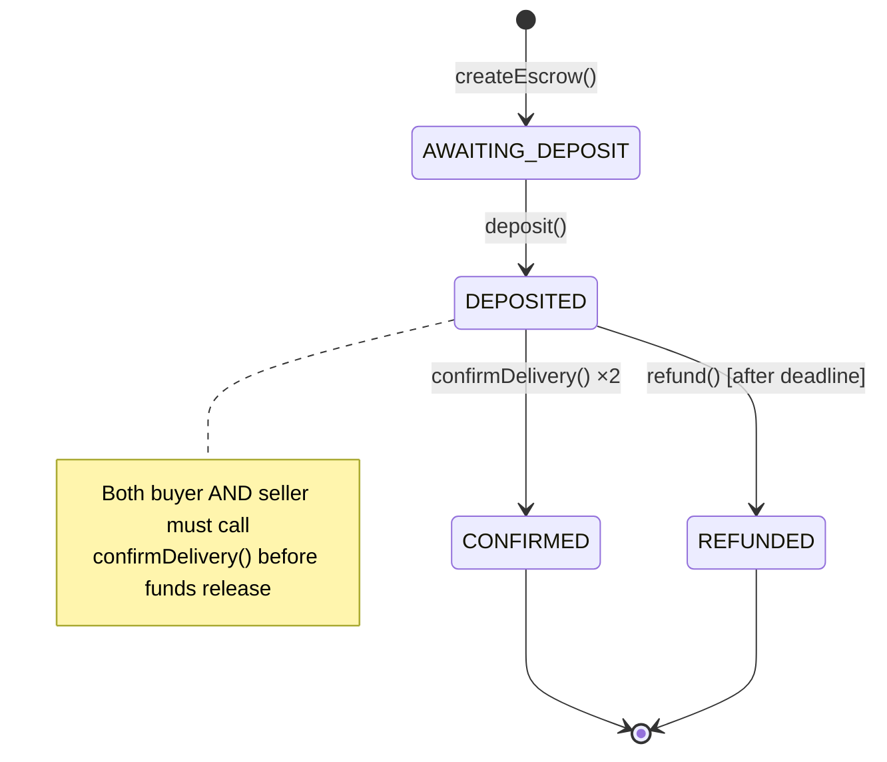
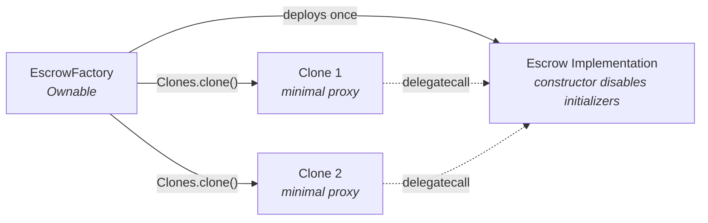

# Contracts

Smart contracts for the Pinky Swear escrow dApp.

## Escrow State Machine



## Contract Architecture



Each escrow is a [minimal proxy (EIP-1167)](https://eips.ethereum.org/EIPS/eip-1167) that delegates all calls to a single implementation contract. This saves gas on deployment (~10x cheaper than deploying full contracts). Clones use `initialize()` instead of a constructor.

## Contract Interface

### EscrowFactory

| Function | Access | Description |
|----------|--------|-------------|
| `createEscrow(buyer, seller, amount, deadline)` | `onlyOwner` | Deploys a new escrow clone |

### Escrow

| Function | Access | Description |
|----------|--------|-------------|
| `deposit()` | `onlyBuyer` | Deposits the exact ETH amount |
| `confirmDelivery()` | `onlyBuyerOrSeller` | Records confirmation; releases funds when both confirm |
| `refund()` | `onlyBuyer` | Refunds buyer after deadline expires |
| `getDetails()` | `view` | Returns all escrow state |

## Testing

Dual test approach:

| Type | Files | Runner | Purpose |
|------|-------|--------|---------|
| Solidity | `*.t.sol` | Foundry (via Hardhat) | Unit tests with `vm` cheatcodes |
| TypeScript | `test/*.ts` | Mocha + ethers.js | Integration tests with event assertions |

## Development

### Prerequisites

- Node.js 22.10.0 (see `.tool-versions`)

### Setup

```bash
cd contracts
npm install
```

### Commands

```bash
npm run compile          # Compile contracts
npm test                 # Run all tests
npm run test:sol         # Solidity tests only
npm run test:ts          # TypeScript tests only
npm run test:gas         # Tests with gas reporting
npm run clean            # Clear artifacts/cache
```

### Deploy to Sepolia

1. Configure secrets:
```bash
npx hardhat keystore set SEPOLIA_RPC_URL
npx hardhat keystore set SEPOLIA_PRIVATE_KEY
npx hardhat keystore set ETHERSCAN_API_KEY
```

2. Deploy:
```bash
npm run deploy:sepolia
```

Deployment addresses are saved to `ignition/deployments/chain-11155111/deployed_addresses.json`. The `record-deployment.ts` script extracts factory addresses and ABIs to `deployments/` for the indexer to consume.

## CI/CD

- **contracts-ci.yml** — On push to `master` and PRs: compile → test with gas stats
- **contracts-deploy.yml** — Manual dispatch: deploy to Sepolia → record deployment → commit addresses + ABIs
