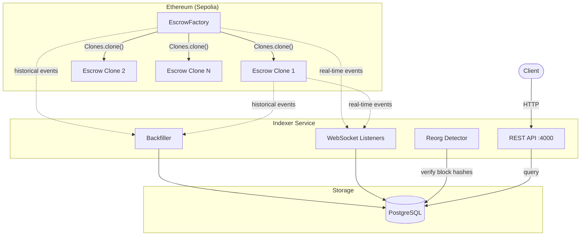

# Architecture

```mermaid
flowchart TB
    subgraph Ethereum["Ethereum (Sepolia)"]
        Factory[EscrowFactory]
        E1[Escrow Clone 1]
        E2[Escrow Clone 2]
        EN[Escrow Clone N]
        Factory -->|"Clones.clone()"| E1
        Factory -->|"Clones.clone()"| E2
        Factory -->|"Clones.clone()"| EN
    end

    subgraph Indexer["Indexer Service"]
        BF[Backfiller]
        LS[WebSocket Listeners]
        RD[Reorg Detector]
        API[REST API :4000]
    end

    subgraph Storage["Storage"]
        DB[(PostgreSQL)]
    end

    Factory -.->|historical events| BF
    E1 -.->|historical events| BF
    Factory -.->|real-time events| LS
    E1 -.->|real-time events| LS
    BF --> DB
    LS --> DB
    RD -->|verify block hashes| DB
    API -->|query| DB

    Client([Client]) -->|HTTP| API
```
