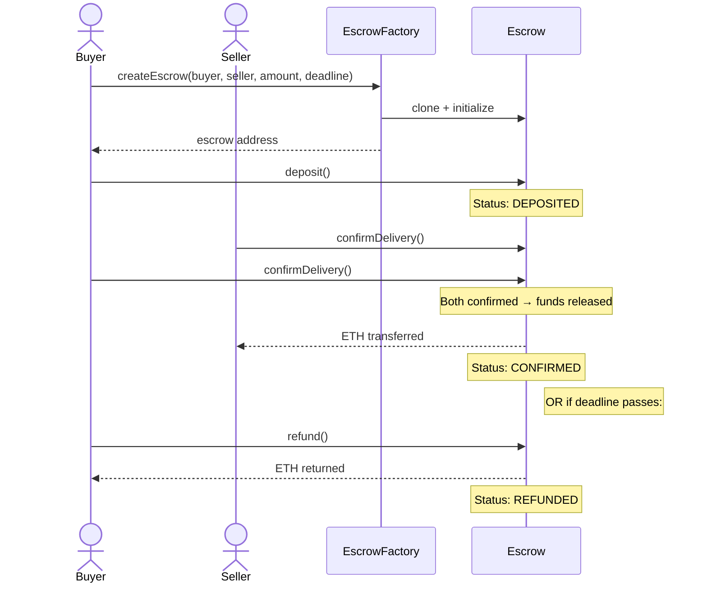

# User Flow

```mermaid
sequenceDiagram
    actor Buyer
    actor Seller
    participant Factory as EscrowFactory
    participant Escrow

    Buyer->>Factory: createEscrow(buyer, seller, amount, deadline)
    Factory->>Escrow: clone + initialize
    Factory-->>Buyer: escrow address

    Buyer->>Escrow: deposit()
    Note over Escrow: Status: DEPOSITED

    Seller->>Escrow: confirmDelivery()
    Buyer->>Escrow: confirmDelivery()
    Note over Escrow: Both confirmed → funds released
    Escrow-->>Seller: ETH transferred
    Note over Escrow: Status: CONFIRMED

    Note right of Escrow: OR if deadline passes:
    Buyer->>Escrow: refund()
    Escrow-->>Buyer: ETH returned
    Note over Escrow: Status: REFUNDED
```
