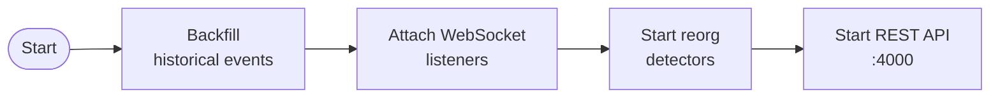
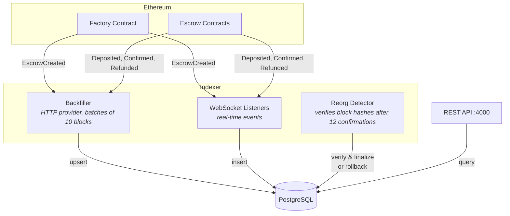
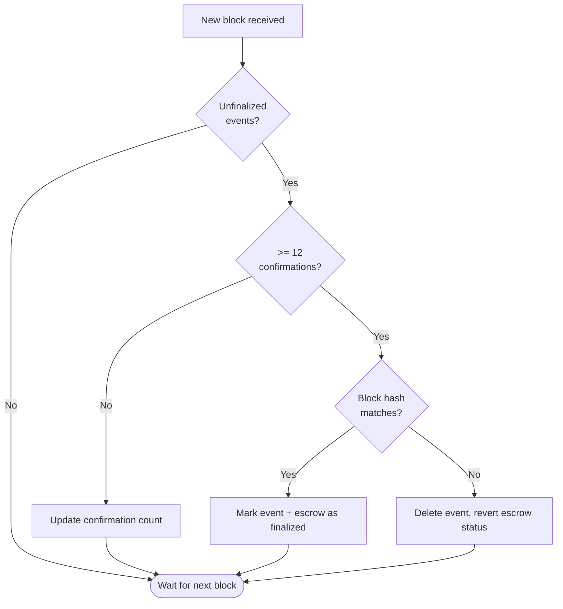

# Indexer

Event indexer and REST API for the Pinky Swear escrow dApp. Tracks on-chain escrow events, persists them to PostgreSQL, and serves them through a REST API.

## Startup Sequence



## Data Flow



## Reorg Detection

The indexer tracks block confirmations for every event. After 12 confirmations, it compares the stored `blockHash` against the canonical chain:



## API Endpoints

| Method | Path                       | Query Params                                  | Description                       |
| ------ | -------------------------- | --------------------------------------------- | --------------------------------- |
| `GET`  | `/escrows`                 | `buyer`, `seller`, `offset`, `limit`, `order` | List escrows (paginated, max 100) |
| `GET`  | `/escrows/:address`        | —                                             | Get escrow with all events        |
| `GET`  | `/escrows/:address/status` | —                                             | Get escrow finalization status    |
| `GET`  | `/events/:id`              | —                                             | Get a single event                |
| `GET`  | `/events/:id/status`       | —                                             | Get event finalization status     |

## Database Schema

Three Prisma models in `prisma/schema.prisma`:

| Model            | Key                                | Purpose                                                |
| ---------------- | ---------------------------------- | ------------------------------------------------------ |
| **Escrows**      | contract address                   | Escrow state (buyer, seller, amount, deadline, status) |
| **Events**       | uuid (unique on txHash + logIndex) | On-chain events linked to escrows                      |
| **IndexerState** | singleton                          | Tracks `lastIndexedBlock` for resumable backfilling    |

## Development

### Prerequisites

- Node.js 22.10.0 (see `.tool-versions`)
- PostgreSQL running locally

### Setup

```bash
cd indexer
npm install
cp .env.example .env   # then fill in values
npx prisma generate
npx prisma migrate dev
```

### Environment Variables

| Variable        | Description                                                  |
| --------------- | ------------------------------------------------------------ |
| `DATABASE_URL`  | PostgreSQL connection string                                 |
| `RPC_HTTPS_URL` | Ethereum HTTP RPC (e.g. Alchemy)                             |
| `RPC_WS_URL`    | Ethereum WebSocket RPC                                       |
| `NETWORK`       | Network name matching `contracts/deployments/{network}.json` |

### Run

```bash
npx tsx src/index.ts
```
